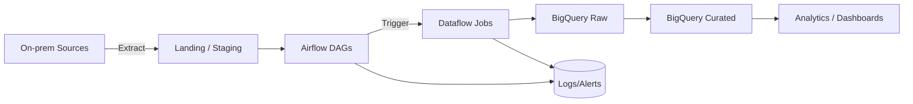

## Snapshot (recruiter-friendly)
**Goal:** Move legacy on‑prem ETL into a cloud-native workflow that is easier to operate, re-run, and scale.

**My role:** owned parts of the orchestration + transformation workflow (DAG design, reliability, curated outputs).

**What shipped:** automated batch pipelines landing in **BigQuery**, with clear raw/curated layers and repeatable runs.

## Architecture

## What I did
- **Orchestration:** built/maintained **Airflow DAGs** with retries, SLAs, and backfill support.
- **Transforms:** wrote **Python + SQL** logic to clean/standardize data and produce curated tables.
- **Warehouse modeling:** organized **raw → curated** BigQuery datasets to reduce downstream breakage.

## Reliability & data quality (the “DE signal”)
- **Idempotent loads** so re-runs don’t double-count.
- **Schema checks** (expected columns/types) + sanity checks (row counts, duplicates).
- **Operational visibility** via logs/alerts to reduce time-to-diagnose.

## Next improvements (if I had more cycles)
- Add **dbt** for curated models + tests.
- Add **partitioning/clustering** guidelines for BigQuery cost + performance.
- Add lightweight **lineage + docs** so new stakeholders can self-serve.
