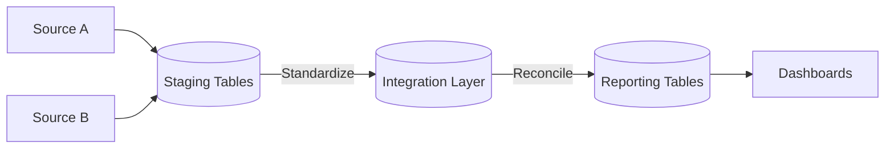

## Snapshot (recruiter-friendly)
**Goal:** Reduce manual reconciliation work and make reporting fast + trustworthy.

**Impact:** **60%** less manual reconciliation time; **40%** faster queries.

**What shipped:** SQL Server integration + reconciliation layer feeding reporting tables + dashboards.

## Architecture (simplified)

## Reliability patterns
- Repeatable runs (same inputs → same outputs)
- Controlled updates to reporting tables
- Monitoring key reconciliation metrics

## Outcome
- Manual reconciliation time reduced by **60%**
- Query performance improved by **40%**
